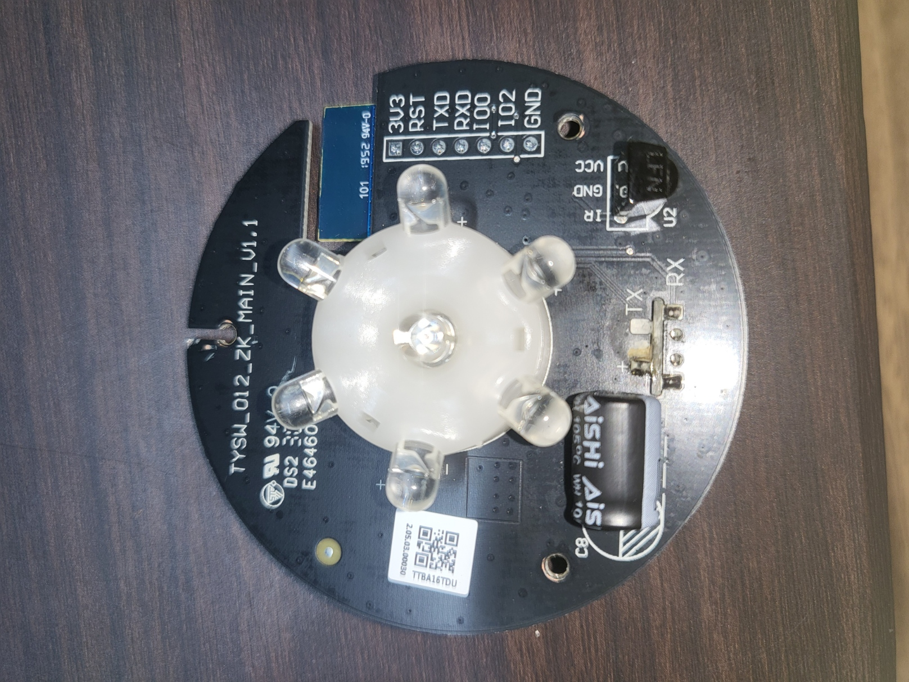

# 🚀 헤이홈(Hejhome) IR 블래스터 무납땜 ESPHome 플래싱 가이드

Tuya 기반의 **헤이홈(Hejhome) 스마트 리모컨(IR 블래스터)** 기기를 납땜 없이 ESPHome으로 플래싱하여 홈어시스턴트(Home Assistant)에 완벽한 로컬로 연동하는 방법입니다.

**기판의 RX/TX 핀이 마이크로 USB 포트의 데이터 핀(D+, D-)과 30옴 저항으로 다이렉트 연결되어** 있습니다. 

## 🛠 준비물
* 헤이홈 IR 블래스터 본체
* 안 쓰는 마이크로 USB 케이블 1개 (데이터 통신용, 4가닥 선이 모두 있는 것)
* USB to TTL (UART, CH340 등) 변환 모듈
* 핀셋 (부팅 시 핀 쇼트용)
* 얇은 헤라 또는 일자 드라이버 (기기 분해용)

---

## 🪛 1. 기기 분해 방법

기기 하단에는 고정 나사가 없습니다.
상단 커버는 오직 내부 걸쇠로만 고정되어 있으므로, 기기의 **앞쪽 가운데** 또는 **뒤쪽 가운데 틈새에 얇은 헤라를 밀어 넣고 살짝 비틀어 올리면** 쉽게 뚜껑을 분리할 수 있습니다.

커버를 분리하면 아래와 같은 메인 보드(`TYSW_012_ZK_MAIN_V1.1`)를 확인할 수 있습니다.



---

## 🔌 2. USB 케이블 개조 및 결선 (가장 중요)

마이크로 USB 케이블의 중간을 잘라 피복을 벗기고, UART 모듈과 다음과 같이 **교차 연결(RX ↔ TX)** 합니다.

| UART 변환 모듈 | 연결 선 색상 (예시) | 기기 내부 (TYSW 보드) |
| :--- | :---: | :--- |
| **RX** 핀 | 녹색 (Green) 선 ↔ 녹색 (Green) 선 | **TX** |
| **TX** 핀 | 흰색 (White) 선 ↔ 흰색 (White) 선 | **RX** |
| **GND** 핀 | 검정 (Black) 선 ↔ 검정 (Black) 선 | **GND** |

*(※ 케이블 제조사에 따라 데이터 선의 색상이 다를 수 있으므로, 통신이 안 될 경우 RX와 TX 선의 위치를 서로 맞바꿔 보세요.)*

---

## ⚡ 3. 다운로드 모드(Flash Mode) 진입

펌웨어를 쓰기 위해 칩셋을 다운로드 모드로 켜야 합니다.

1. 기기 기판의 **`IO0` 핀과 `GND` 핀을 핀셋으로 꾹 눌러 쇼트**시킵니다.
2. 핀셋으로 쇼트시킨 상태를 유지하며, 개조한 USB 케이블을 PC에 꽂아 전원을 넣습니다.
3. 전원 인가 후 약 1~2초 뒤에 핀셋을 뗍니다.
4. *(선택)* 터미널 프로그램(보우레이트 74880)으로 부팅 로그 확인 시 `boot mode:(1,7)` 형태가 나오면 성공입니다.

---

## 💻 4. ESPHome 펌웨어 플래싱

 **ESPHome** 에서 새 기기를 만들고, 아래 코드를 사용하여 **유선(Plug into this computer)**으로 플래싱합니다. (와이파이 정보 등은 본인 환경에 맞게 수정하세요.)

```yaml
# Board: Espressif Generic ESP8266 ESP-01 1M
# Definition: definitions/boards/esp01_1m/manifest.yaml

esphome:
  name: remote-controller
  friendly_name: remote controller

esp8266:
  board: esp01_1m

logger:

api:
  encryption:
    key: "*****************"
  services:
    - service: send_raw_command
      variables:
        command: int[]
      then:
        - remote_transmitter.transmit_raw:
            code: !lambda 'return command;'
            transmitter_id: ir_tx
            carrier_frequency: 38kHz
    - service: send_pronto_command
      variables:
        command: string
      then:
        - remote_transmitter.transmit_pronto:
            data: !lambda 'return command;'
            transmitter_id: ir_tx
ota:
  - platform: esphome

wifi:
  ssid: !secret wifi_ssid
  password: !secret wifi_password
  manual_ip: #수동 IP 설정
    static_ip: 192.168.x.x
    gateway: 192.168.x.x
    subnet: 255.255.255.0
  ap:
    ssid: remote controll Fallback Hotspot
    password: "password"

captive_portal:

# IR 송신 핀 설정
remote_transmitter:
  pin: GPIO14
  carrier_duty_percent: 50%
  id: ir_tx 

remote_receiver:
  pin:
    number: GPIO5
    inverted: true
  dump: all
  id: ir_rx
  
sensor:
  - platform: homeassistant
    id: current_temperature
    entity_id: sensor.silnae_ondo
    internal: true

climate:
  - platform: climate_ir_lg    # LG 에어컨 로컬 제어 플랫폼
    name: "거실 에어컨"
    sensor: current_temperature
    transmitter_id: ir_tx
    receiver_id: ir_rx       # 실물 리모컨 수신 동기화 활성화
    # 실제 수신 타이밍에 맞게 기준값 튜닝
    header_high: 3150us
    header_low: 9900us
    bit_high: 440us
    bit_one_low: 1600us
    bit_zero_low: 580us
```
